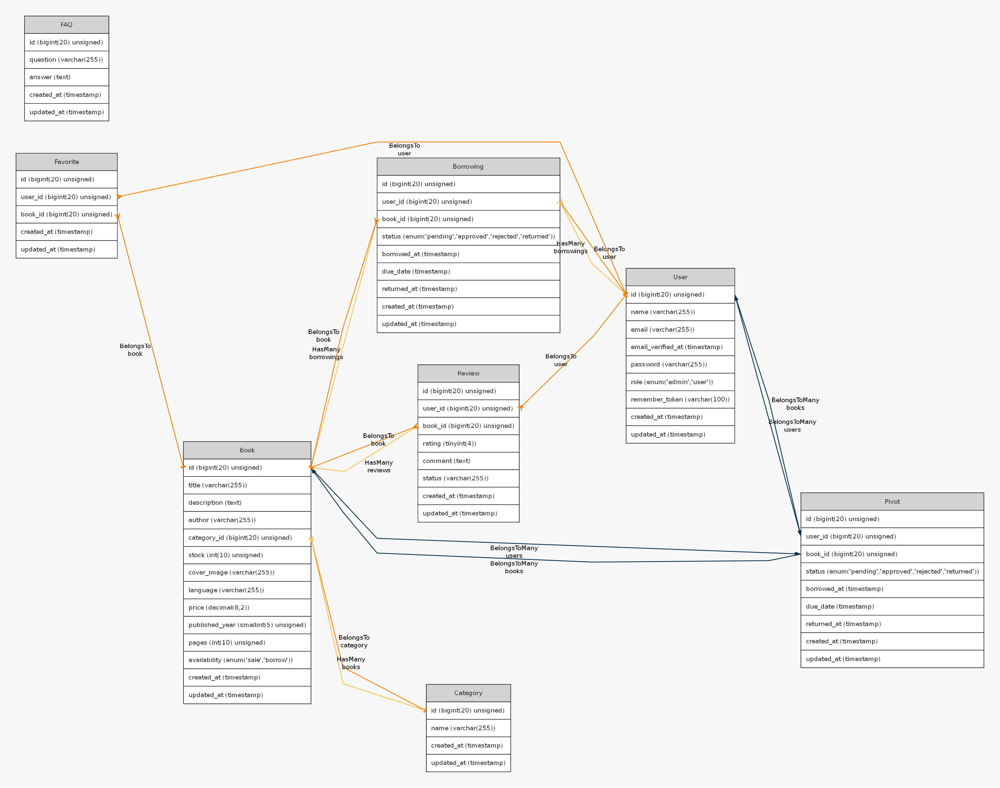

# 📚 E-Library Management System (ELMS)

## 📌 Overview

**E-Library Management System (ELMS)** is a scalable backend system built with Laravel, designed to provide secure and high-performance RESTful APIs for managing digital libraries.

The system follows **Clean Architecture principles**, implementing a clear separation between layers such as Controllers, Services, Repositories, and DTOs — making it highly maintainable and production-ready.

> ⚠️ **Status:** The project is currently under active development.

---

## 🧰 Tech Stack

```text
Laravel          – Backend Framework
PHP 8.x          – Core Language
MySQL            – Relational Database
Laravel Sanctum  – API Authentication
REST API         – Communication Architecture
Clean Architecture – System Design Pattern
DTOs + Enums     – Structured Data Handling
```

---

## 🧱 Architecture Overview

This project strictly follows a layered architecture:

```text
Client Request
     ↓
Routes (api/v1)
     ↓
Middleware (Auth / Admin)
     ↓
Controller
     ↓
Service Layer (Business Logic)
     ↓
Repository Layer (Data Access)
     ↓
Model (Eloquent ORM)
     ↓
Database

Exception → Handler → JSON Error Response
Resource → API Response Formatting
```

---

## 📁 Project Structure

```text
app/
 ├── DTOs/                → Data Transfer Objects
 ├── Enums/               → Enum types (e.g. BorrowingStatus)
 ├── Exceptions/          → Custom exception handling
 │
 ├── Http/
 │    ├── Controllers/
 │    │    └── API/v1/
 │    │         ├── Admin/
 │    │         ├── Website/
 │    │         └── Auth/
 │    │
 │    ├── Requests/       → Form validation
 │    └── Resources/      → API response formatting
 │
 ├── Models/              → Eloquent models
 ├── Services/            → Business logic layer
 │
 ├── Repositories/
 │    ├── Contracts/      → Interfaces
 │    └── Eloquent/       → Implementations
 │
 └── Providers/           → Service bindings
```

---

## 📦 Features

### ✅ Implemented

* 🔐 Authentication (Laravel Sanctum)
* 👤 User management (Admin & Users)
* 📚 Books management (CRUD)
* 🏷️ Categories system
* ❤️ Favorites system
* ⭐ Reviews system
* ❓ FAQ module
* 📦 Clean Architecture implementation
* 📡 RESTful API with versioning (`v1`)
* ⚙️ DTOs for structured data transfer
* 🧩 Repository Pattern (Interface + Implementation)
* 🛡️ Custom Exception Handling

---

### 🚧 In Progress

* 📖 Borrowing system enhancements
* ⏳ Book reservation system
* 🔍 Advanced filtering & search
* 📊 Admin analytics dashboard
* 🔔 Notifications system

---

## 🧭 API Modules

### 🔑 Auth

* Register
* Login
* Logout

### 📚 Books

* CRUD operations
* Image upload support

### ❤️ Favorites

* Add / Remove favorite books
* Get user favorites

### 📖 Borrowings

* Borrow books
* Track borrowing status

### ⭐ Reviews

* Add reviews to books

### 🏷️ Categories

* Organize books

### ❓ FAQ

* Manage common questions

---

## 🧭 ERD



---

## 🚀 Getting Started

```bash
git clone https://github.com/your-username/e-library.git

cd e-library

composer install

cp .env.example .env
php artisan key:generate

php artisan migrate

php artisan serve
```

---

## 🔐 Authentication

The system uses **Laravel Sanctum**.

Include token in headers:

```http
Authorization: Bearer YOUR_TOKEN
```

---

## 🧪 Testing

```bash
php artisan test
```

---

## 🧠 Design Principles

* Separation of concerns
* Dependency Injection via Interfaces
* Scalable and maintainable structure
* Clean and reusable code
* Consistent API responses using Resources

---

## 🤝 Contributing

```bash
Fork → Create Branch → Commit → Pull Request
```

---
